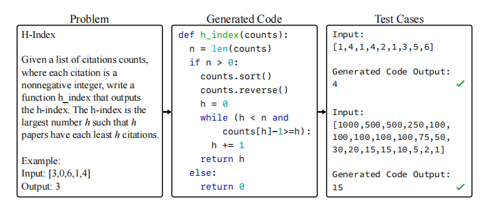

# APPS:Automated Programming Progress Standard

APPS是 Hendrycks 等人提出的用来衡量语言模型编程能力的数据集，衡量了模型将任意自然语言规范转换为令人满意的Python代码的能力。类似于公司如何评估候选软件开发人员，APPS通过检查模型在测试用例上生成的代码来评估模型。APPS包括10,000个问题，涵盖简单的单行解决方案和重要的算法挑战，每个编程问题都有若干个 unit tests，其中5000个编程问题作为训练集，5000个编程问题作为测试集，训练集中的每个问题还包括若干个正确答案。

APPS 数据集包含从不同的开放访问编码网站收集的问题，如 Codeforces（全球最著名的在线评测系统之一）、Kattis（算法竞赛网站）等。APPS 基准测试试图通过在不受限制的自然语言中提出编码问题并使用测试用例来评估解决方案的正确性，以反映人类程序员是如何被评估的。

该基准总共包含 10,000 个编码问题，为了验证模型给出的答案，数据集包含 131,836 个测试用例和 232,444 个人类编写的实际解决方案。其中，问题的平均长度是 293.2 words，其复杂度可能会很高。数据划分为训练集和测试集，各包含 5000 个问题。而在测试集中，每个问题都有多个测试用例，测试用例的平均个数为 21.2。并且每个测试用例都是为相应的问题专门设计的，有助于严格地评估程序的功能。

下面是对APPS基准的介绍。

APPS的一个示例问题（左）以及可能生成的代码（中），以及用来评估生成代码的两个示例测试用例（右）。评估框架包括测试用例和10,000个不同难度级别的代码生成问题，从简单的入门级问题、面试级问题到竞赛级不等。

如果模型在 APPS 上表现良好，则表明它具有灵活使用数据结构和编程技术的能力，以及正确理解各种任务说明，遵循并理解人的意图的能力。

APPS 数据集的难度：

数据集中的每个问题来源都使用单独的难度量表来衡量。团队将这些不同来源的问题归结为三类。

例如，源自 Kattis 网站的问题，难度系数小于 3 的被归类为 “入门级”，难度在 3 到 5 之间的被归类为 “面试级”，难度大于 5 的为 “竞赛级”。具体介绍如下：

**入门级（Introductory Level）：**此类问题不需要复杂的算法，有 1-2 年经验的程序员便可以回答，有 3639 个。这类问题的例子包括计算字符串中的元音数量，或返回整数列表的运行和。

**面试级（Interview Level）：**此类问题会涉及算法，能达到编程技术面试中的难度水平，有 5000 个。这类问题的例子可能包括树或图等数据结构的问题，或者需要非平凡算法（nontrivial algorithms）的问题。

**竞赛级（Competition Level）：**此类问题最具挑战性，难度最高，达到最先进的高中和大学编程竞赛的水平，包括 USACO、IOI 和 ACM 等，有 1361 个 。