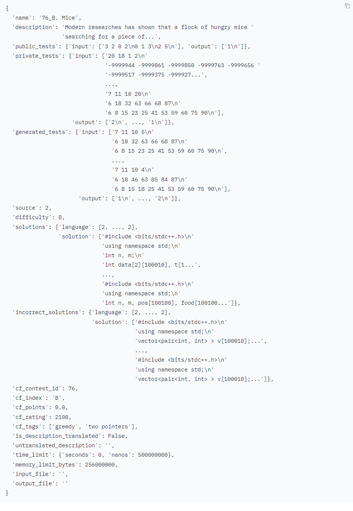

# CodeContest

CodeContest是一个竞争性编程问题数据集，在训练AlphaCode时候用到了该数据集。

在GitHub上预训练的模型可以生成良好的代码并解决简单的编程问题，但它们只能解决很少的竞争性编程问题。将模型Fine-tuning在专门的竞争性编程数据集上对性能至关重要。为了便于Fine-tuning和评估，在提出AlphaCode的时候，作者们策划了一个新的竞赛编程问题数据集，名为CodeContests。该数据集包括从Codeforces平台上爬取的问题、解决方案和测试用例，以及已有的公共竞赛编程数据集混合到我们的训练集中。

CodeContest数据集规范很多，包含问题，解答，还有测试用例。这里微调的数据涉及到一个数据划分的问题，这里采用按照时间划分训练集/验证集/测试集。然后还涉及到一个测试用例的问题（因为还需要通过测试用例来判断程序的正确性），所以测试用例过少会导致假阳性，为此作者使用了一些方法来自动创建新的测试用例。

下面是一个数据样例：

每个字段的说明：

name：比赛名称。需要注意的是，不同来源的名称可能不一致。 

description：编程问题的自然语言描述。 

public_tests：公共测试指的是在提交解决方案之前就可以使用的测试，通常作为问题描述的一部分。以可配对的输入和输出形式表示，可用于测试可能的解决方案。因此，它们是模型可接受的输入。 

private_tests：私有测试在提交解决方案之前不可见，因此不应将其作为模型的输入。 

generated_tests：生成的测试是通过修改公共和私有测试的输入并使用已知的正确解决方案进行验证自动生成的测试。

source：问题的原始来源，可能的值包括UNKNOWN_SOURCE（0）、CODECHEF（1）、CODEFORCES（2）、HACKEREARTH（3）、CODEJAM（4）、ATCODER（5）和AIZU（6）。 

difficulty：问题难度的表示形式，可能的值包括UNKNOWN_DIFFICULTY（0）、EASY（1）、MEDIUM（2）、HARD（3）、HARDER（4）、HARDEST（5）、EXTERNAL（6）、A（7）、B（8）、C（9）、D（10）、E（11）、F（12）、G（13）、H（14）、I（15）、J（16）、K（17）、L（18）、M（19）、N（20）、O（21）、P（22）、Q（23）、R（24）、S（25）、T（26）、U（27）和V（28）。需要注意的是，不同来源使用不同的、不可比较的分级方式。对于Codeforces的问题，如果可用，cf_rating是一个更可靠的难度度量标准。 

solutions：问题的正确解决方案。与下面的incorrect_solutions相对应。 

incorrect_solutions：问题的不正确解决方案。 

cf_contest_id：比赛ID。需要注意的是，比赛ID不是随时间单调递增的。 

cf_index：问题的索引，例如“A”或“B”或“C”。 

cf_points：问题的分值，例如1000.0。 

cf_rating：问题的难度等级，例如1100。 

cf_tags：问题的标签，例如['greedy', 'math']。 

is_description_translated：问题是否被翻译成英语。 

untranslated_description：未翻译的问题描述仅适用于翻译后的问题。 

time_limit：执行解决方案时使用的时间限制约束。表示为一个带有两个键（秒和纳秒）的字典。如果未定义，则该字段为None。 memory_limit_bytes：执行解决方案时使用的内存限制约束。 

input_file：大多数问题使用标准输入输出。有些问题需要使用特定的文件。