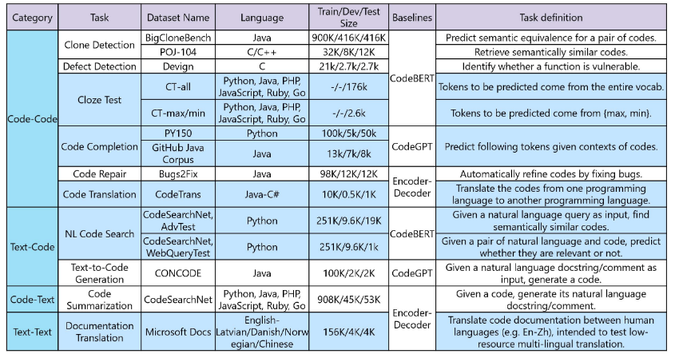

# CodeXGLUE

我目前基本上所有的实验评测都是在CodeXGLUE基准上进行的，对这个benchmark的代码补全、代码生成、代码摘要任务的数据集非常的熟悉。

CodeXGLUE包括14个数据集，用于10项代码智能任务，涵盖以下场景：

- **[code-code](https://github.com/microsoft/CodeXGLUE/tree/main/Code-Code)** (clone detection, defect detection, cloze test, code completion, code repair, and code-to-code translation)
- **[text-code](https://github.com/microsoft/CodeXGLUE/tree/main/Text-Code)** (natural language code search, text-to-code generation)
- **[code-text](https://github.com/microsoft/CodeXGLUE/tree/main/Code-Text/)** (code summarization)
- **[text-text](https://github.com/microsoft/CodeXGLUE/tree/main/Text-Text)** (documentation translation)

CodeXGLUE的简要概述如下，包括任务、数据集、语言、各种状态下的大小、baseline、提供者以及每个任务的简短定义。以蓝色突出显示的数据集是新引入的。

