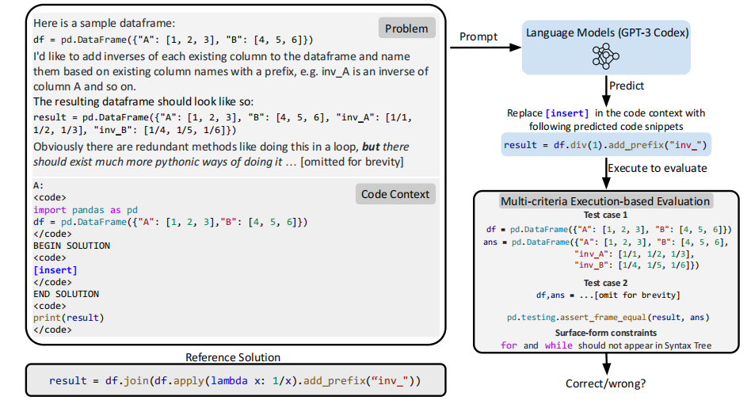

# DS-1000

DS-1000，是一个包含1000个数据科学问题的**代码生成**基准，涵盖了七个Python库，如NumPy和Pandas。与之前的工作相比，DS-1000具有三个核心特点。首先，问题反映了多样化、现实和实际的使用情况，因为我们从StackOverflow中收集了它们。其次，我们的自动评估非常具体（可靠）——在我们的评估接受的所有Codex-002预测解决方案中，只有1.8％是不正确的；我们通过多标准度量实现这一点，检查功能正确性，通过运行测试用例和限制API用法或关键字来检查表面形式约束。最后，我们积极防止记忆化，通过轻微修改我们的问题与原始的StackOverflow源不同；因此，模型无法通过记忆预训练中的解决方案来正确回答它们。目前最好的Codex-002的准确率为43.3％，还有充足的改进空间。

DS-1000数据的一个例子。模型需要在左侧的提示“[insert]”中填写代码，然后执行代码以通过多准则自动评估，其中包括测试用例和表面形式的约束；左下方提供了一个参考解决方案。

