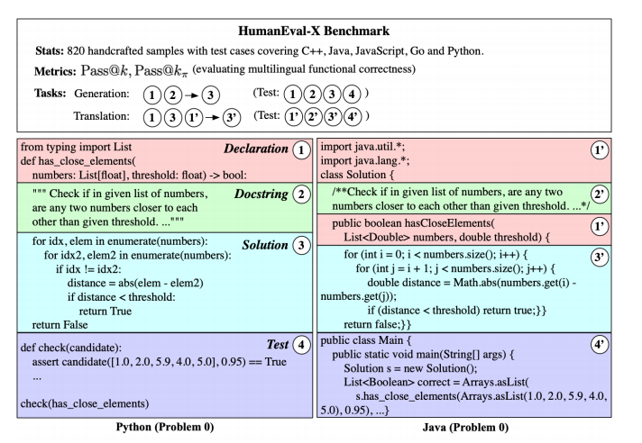

# HumanEval-X

HumanEval-X基准测试，用于评估多语言代码模型。该基准测试定义了164个代码问题，覆盖C ++、Java、JavaScript、Go和Python等五种主要语言，共计820（164*×*5=820）个问题-解决方案对。对于每个问题，它都支持代码生成和代码翻译任务。

HumanEval 是一个由 OpenAI 开发的用于评估 Codex 的工具。然而，类似于 MBPP 和 APPS ，HumanEval 只包含 Python 编程的手工制作问题，因此不能直接应用于系统地评估多语言代码生成的性能。

对于HumanEval中仅为Python定义的每个问题，我们需要手动将其提示、标准解决方案和测试用例在另外四种语言中——C++、Java、JavaScript和Go中进行重写。在HumanEval-X中，我们总共有820个问题-解决方案对，每个对包含以下部分：

• task_id: 由编程语言和数字问题编号组成，例如Java/0表示Java中的第0个问题； 

• declaration: 函数声明，包括必要的库或包； 

• docstring: 描述函数功能和示例输入/输出的说明文档； 

• prompt: 函数声明加上docstring； 

• canonical_solution: 该问题的可验证解决方案； 

• test: 包括测试用例的测试程序。

HumanEval-X中代码生成和翻译任务的示例。声明、文档字符串、解决方案和测试用例分别用红色、绿色、蓝色和紫色标记。生成任务使用声明和文档字符串作为输入来生成解决方案。翻译任务使用两种语言中的声明和源语言中的解决方案作为输入，生成目标语言中的解决方案（不使用文档字符串以防止模型直接解决问题）。