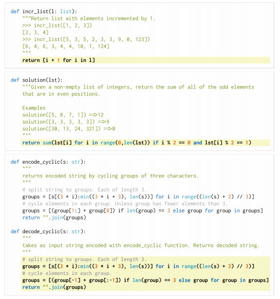
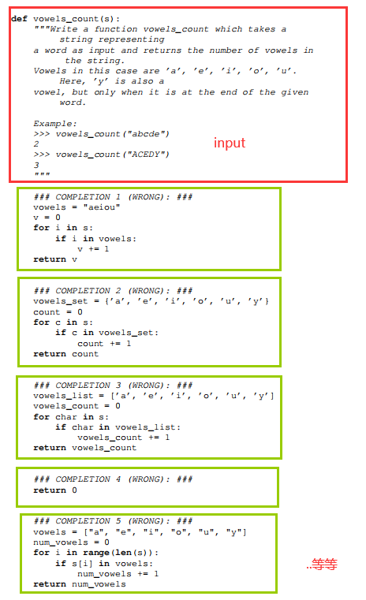

# HumanEval: Hand-Written Evaluation Set

HumanEval包含164个手写编程问题，用来评估函数功能的正确性。每个问题都包括一个函数签名（function signature）、文档字符串（docstring）、代码实现（body）以及若干个单元测试（several unit tests），每个问题平均包含7.7个测试。这些任务需要手写，因为我们的模型是在GitHub的大部分数据集上进行训练的，该数据集已经包含了来自各种来源的问题解决方案。例如，有超过十个公共代码库包含了Codeforces问题的解决方案，这些问题构成了最近提出的APPS数据集的一部分。

HumanEval数据集中的编程问题评估了语言理解、推理、算法和简单的数学能力。可以评估功能正确性，并测量模型的问题解决能力。

HumanEval数据集中的三个示例问题，其中Codex-12B生成的单个样本通过单元测试的概率分别为0.9、0.17和0.005。

白色背景：向模型提供的提示（输入）

黄色背景：target，我们想要的答案（输出）

编程问题可能不是新颖的，但所有问题均为手写，不是通过从现有的一些代码网站、代码库中复制而来的。

下面是CodeX的paper中展示的Codex-12B在一些问题上的生成结果。

