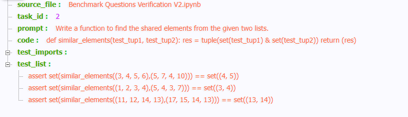

# MBPP:Mostly Basic Programming Problems

“Mostly Basic Programming Problems”数据集包含974个短小的Python程序，这些程序是通过向一个有基本Python知识的群体内众包构建而成的。我们要求众包参与者编写一个简短的问题陈述、一个解决指定问题的Python函数以及三个测试用例，以检查函数的语义正确性。每个问题都由任务描述、代码解决方案和3个自动化测试用例组成。参与者还提供了一个通过所有三个测试用例的真实解决方案。我们要求参与者编写足够具体的描述，以便人类能够在没有澄清的情况下将其翻译成代码。参与者也被告知要编写自包含的代码（即，它可以独立运行），并且不要在控制台上输出任何结果。允许使用互联网参考资料。

下面是一个数据样例：

