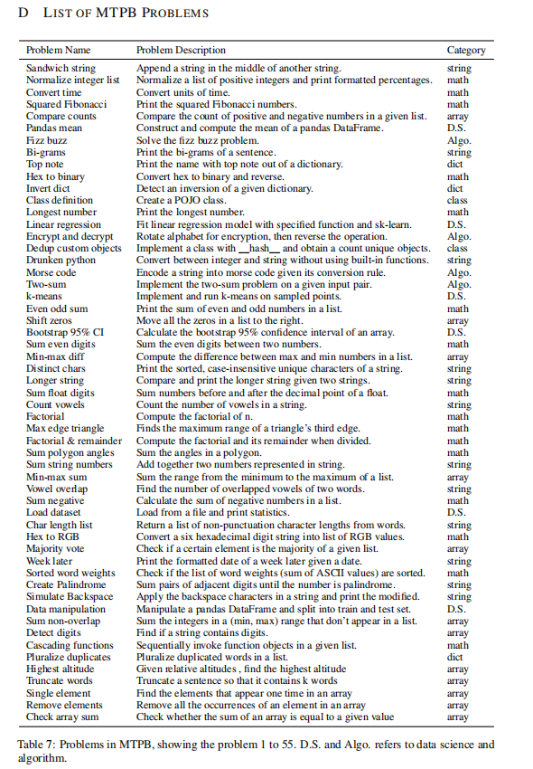
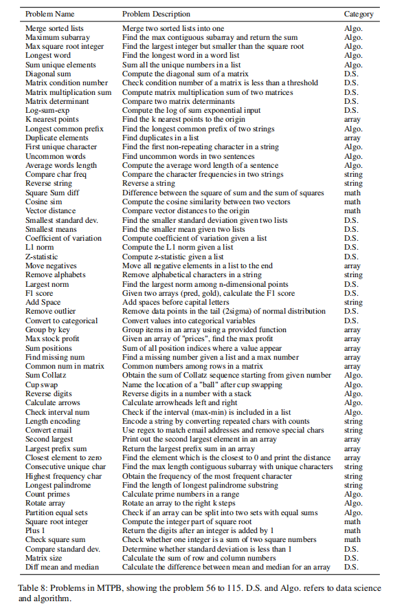
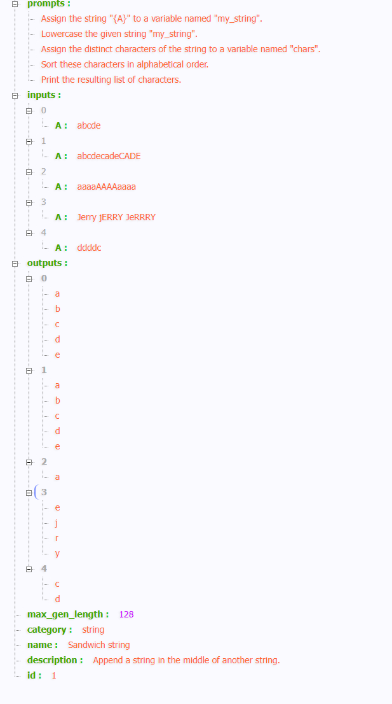

# Multi-Turn Programming Benchmark (MTPB)

首先定义了115个问题，分别属于编程知识，包括数学、数组操作、字符串处理、算法、数据科学以及需要其他知识的问题这几个类别，每个类别中的问题数量大致相等。

MTPB中每个问题的描述由几个子部分组成。在生成阶段逐个输入到模型里：

下面是问题列表：

对于每个问题，构建一个三元组，包括多轮提示P、测试用例输入I和测试用例输出O。多轮提示P遵循以下两个约束条件设计：（1）将问题分解为3轮或更多轮，（2）单个轮次的提示不能解决问题。例如，实现线性回归模型可以被表述为“在x和y上执行线性回归”。由于主要任务完全在此提示中表达，理解此提示就足以执行任务。我们通过手动检查避免这种情况，并分配问题解决提示到多个轮次。

下面是数据格式：

每一个字段的解释：

id：问题ID 

name：问题名称（参见附录D）

description：问题的简要描述 

category：手动标记的问题类别 

prompts：一个启用模板的字符串列表，指定每个步骤。 

inputs：由5个测试用例输入组成的列表。每个测试用例都是将变量（用于模板化提示中）映射到实际值的键值表。 

outputs：由5个测试用例输出组成的列表。每个测试用例是程序的预期输出值。 

max_gen_length：我们为问题设置的每轮的最大令牌数。该值大多数情况下为128，因为每轮不需要大量的代码行，但当需要进行长时间的生成时，我们会将该值调整为更高的数字。