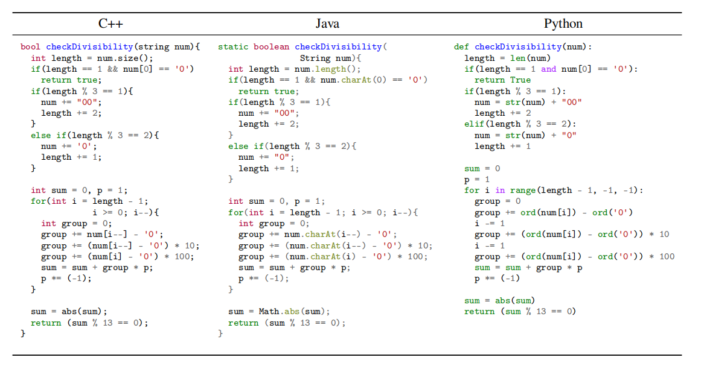

# TransCoder

构建和发布了一个由852个平行函数组成的测试集，以及单元测试来检查翻译的正确性，（包括3种语言c++ java python）。用来评估模型将一种语言的代码翻译成另外一种语言的能力。

测试集中每一行数据的格式： `<FUNCTION_ID> | <function>`.如下所示：

针对于STACK_SET_3_REVERSE_STRING_USING_STACK这个问题，下面是python，java，C++的实现方法。

Python：

```python
STACK_SET_3_REVERSE_STRING_USING_STACK | def reverse ( string ) : NEW_LINE INDENT string = string [ : : - 1 ] NEW_LINE return string NEW_LINE DEDENT
```

Java：

```java
STACK_SET_3_REVERSE_STRING_USING_STACK | static void reverse ( char str [ ] ) { int n = str . length , i ; for ( i = 0 ; i < n / 2 ; i ++ ) { swap ( str , i , n - i - 1 ) ; } }
```

C++

```c++
STACK_SET_3_REVERSE_STRING_USING_STACK | void reverse ( char str [ ] ) { int n = strlen ( str ) , i ; for ( i = 0 ; i < n / 2 ; i ++ ) swap ( & str [ i ] , & str [ n - i - 1 ] ) ; }
```


下面是一个示例，相同功能的函数，不同的编程语言实现方法。

