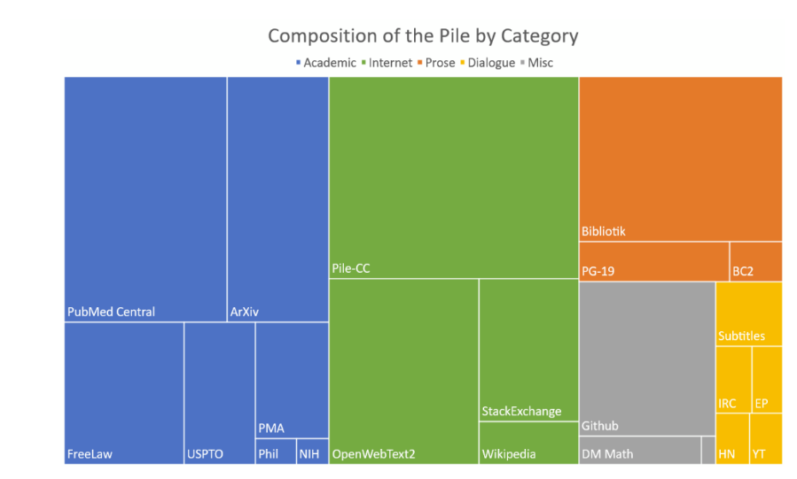
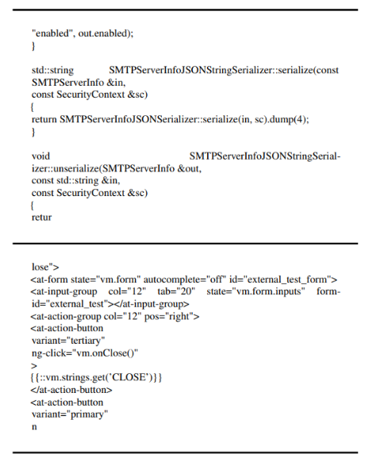

# The Pile

增加训练数据集的多样性，可以提高大规模语言模型的跨域知识能力和下游泛化能力。而为了提升数据集的多样性，ThePile：一个 825GiB 的英语文本语料库被提出。该数据集由 22 个不同的高质量子集构建而成，既有现有的，也有新建的，其中许多来自学术或专业资源。
下图显示了不同数据集的占比情况。其中包含的代码预料是 Github 子集部分（95.16G）

GitHub 是一个大型的开源代码库。使用 The Pile 中的 GitHub 子数据集，可以让模型在与代码相关的任务上实现更好的下游性能。下图是 GitHub 子数据集的一个样本。

