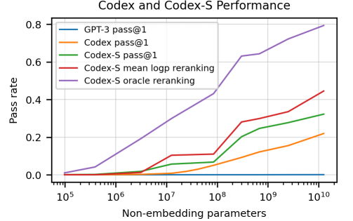

# Codex [OpenAI] [2021.07] [Close]

Paper:[Evaluating Large Language Models Trained on Code](https://arxiv.org/abs/2107.03374)

```yaml
Model Architecture: Decoder Only,GPT Family
Params: 12B
Training Data: Collected[Code:159GB]
Training Time: -
Languages: Python[Multilingual]
Evaluation: HumanEval, APPS
Supported Tasks: Code Generation，Docstring Generation
```


## Contents

[TOC]


## Summary

我们介绍了Codex，一个在GitHub上公开可用的代码上进行了微调的**GPT语言模型**，并研究了其**Python代码编写能力**(初代Codex只支持python，后代支持多语言)。Codex的一个独特的不同版本power了GitHub Copilot。在我们发布的一个新的评估集**HumanEval**中，用于衡量从文档字符串中合成程序的功能正确性，CodeX解决了28.8%的问题，而GPT-3解决了0%，GPT-J解决了11.4%。此外，我们发现从模型中重复抽样是一个出人意料的有效策略，可用于产生难题的解决方案。使用此方法，每个问题抽出100个样本，我们解决了70.2%的问题。对我们的模型进行仔细调查后，我们发现其局限性，包括难以处理描述长操作的文档字符串以及绑定操作到变量的难题。最后，我们讨论了部署强大的代码生成技术可能带来的潜在广泛影响，涵盖了安全、安全性和经济方面。


## Introduction(Motivation)

探究GPT-3在代码领域的潜能。

早期对GPT-3的研究发现，它能够从Python docstrings生成简单的程序。这种能力令人兴奋，因为GPT-3并没有明确地针对代码生成进行训练。鉴于大型语言模型在其他多种形式中取得了显著的成功，以及公开可用代码的丰富性，我们推出一个名为Codex的专门的GPT模型可以在各种编码任务中表现出色。本文描述了几个早期的Codex模型，它们的后代推动了GitHub Copilot和OpenAI API中的Codex模型。


## Contributions

- 推出Codex， Codex-S， Codex-D
- 创建了HumanEval Benchmark

- 作为先驱，做了很多开辟性的工作。比如如何评估模型的代码生成能力，用什么指标评估等等。


## Model

模型使用的架构是 GPT-3。


## Experiments

- ### Dataset

Collected，从 github 上爬下小于 1MB 的 python 文件，去除掉那些可能是自动生成的、平均每行长度大于 100 的、最大行长度大于 1000 的、几乎不含字母数字的。

- ### Training

在 GPT-3 的基础上进行微调，并没有比从头开始预训练效果好，可能的原因是微调（训练）的数据集太大，但从 GPT-3 开始进行微调收敛速度会更快。为了最大限度地利用来自 GPT-3 的文本表示，将代码词典建立在 GPT-3 的 tokenizer之上。但这个 tokenizer 在表示代码方面不是很有效，后续又进行了一些改进，在 GPT-3 的分词器中加入了额外的一些 token 来表示不同长度的空格，这样在表示代码时可以少使用30 % 的 token。


## Results




横轴表示模型的参数量，纵轴表示模型产生的代码的准确率。

- GPT3 pass@1：原始GPT3模型，可以发现它的准确率为0
- Codex pass@1：只经过预训练，在12B参数的情况下，模型准确率为28.8%
- Codex-S pass@1：预训练+fine-tune，在12B参数的情况下，模型准确率为37.7%
- **Codex-S mean logp reranking**：允许模型生成100个答案，并通过计算最大mean logP的方式，选出1个答案，模型准确率为44.5%。
- **Codex-S oracle reranking**：允许模型生成100个答案，并通过单元测的方式，选出1个最佳答案，模型准确率为77.5%。

虽然我们不可能要求每次都以单元测的方式来给出最佳答案，但从logP的方法上，已能说明当前的模型可以解决44.5%的代码问题。并且随着模型参数量的增加，准确率依然有上升的趋势。即如果切换到一个更大的模型上时，还能表现得更好。


## Conclusion

调查了训练大型语言模型以从自然语言文档字符串生成功能正确的代码是否可行。通过在GitHub的代码上微调GPT，我们发现我们的模型在难度与简单面试问题相当的人类编写问题的数据集上表现出色。通过训练一个更类似于评估集的分布以及从模型生成多个样本，可以提高模型的性能。我们还发现，训练模型完成从代码主体生成文档字符串的反向任务非常简单，这些模型的性能特征类似。最后，我们拓展了代码生成模型的更广泛影响，并讨论了模型的局限性，发现还有很大的改进空间。
