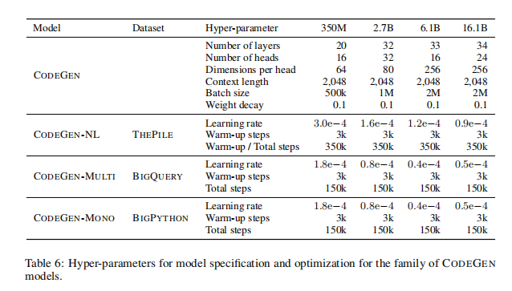
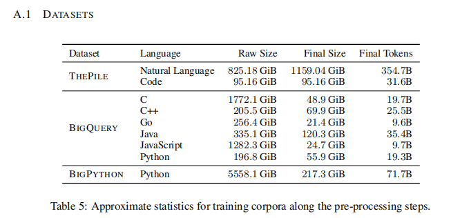

# CodeGen [Salesforce] [2022.03] [[Open]](https://github.com/salesforce/CodeGen)

Paper:[CodeGen: An Open Large Language Model for Code with Multi-Turn Program Synthesis](https://arxiv.org/abs/2203.13474)

```yaml
Model Architecture: Decoder Only
Params: 6.1B, 16.1B
Training Data: The Pile,BigQuery,BigPython[Code:150B tokens Text:355B tokens]
Training Time: -
Languages: CodeGen-Multi(6 langs),CodeGen-Mono(python)
Evaluation: HumanEval, MTPB
Supported Tasks: Single-Turn Code Generation,Multi-Turn Code Generation
```


## Contents

[TOC]


## Summary

程序合成旨在生成计算机程序作为给定问题规范的解决方案，这些规范可以用输入输出示例或自然语言描述表示。大语言模型的普及推进了程序合成的技术水平，但是有限的训练资源和数据妨碍了这种模型的公开使用。为了实现民主化，我们训练并发布了一系列大语言模型，名为CODEGEN，具有高达16.1B个参数，并在自然语言和编程语言数据上进行了训练，并开源了训练库JAXFORMER。我们通过展示CODEGEN在HumanEval的零样本Python代码生成上与之前的技术水平相竞争来展示训练模型的效用。我们进一步研究了程序合成的多步范例，其中单个程序被分解为指定子问题的多个提示。为此，我们构建了一个开放基准，Multi-Turn Programming Benchmark（MTPB），其中包括115个不同的问题集，这些问题集被分解为多轮提示。我们在MTPB上的分析表明，以多轮方式提供给CODEGEN相同的意图，显著改善了程序合成，超过了单次提供的意图。我们将训练库JAXFORMER和模型检查点作为开放源代码贡献提供：https://github.com/salesforce/CodeGen。


## Introduction(Motivation)

在实现程序合成时，会出现两个关键的挑战：

1. 搜索空间比较棘手。
2. 正确表达用户的意图比较困难。

为了成功实现程序合成，用户必须使用某些方法向模型传达其意图，例如逻辑表达式（指定程序输入和输出之间的逻辑关系）、伪代码、输入输出示例或自然语言的口头说明。一方面，完整的正式说明可以享受用户意图的精确说明，但可能需要用户具备领域专业知识和付出努力将意图转化为这种形式。另一方面，仅基于输入输出示例的说明成本较低，但可能会低估意图，导致不准确的解决方案。以前的工作受益于各种方法及其组合作为程序合成模型的输入，包括伪代码（Kulal等，2019）、程序的一部分及其文档（Chen等，2021）或自然语言段落与输入输出示例（Hendrycks等，2021）。然而，我们认为真正用户友好的意图形式是自然语言文本。

为了克服这些挑战，我们提出了一种多步骤程序综合方法，其中用户通过逐步以自然语言提供规范，同时从系统中获得合成的子程序的响应，从而用户与系统一起完成多个步骤中的程序。以下两个考虑因素促使了这种方法。


将一个潜在的长且复杂的规范分解为多个步骤，将有助于模型的理解


## Contributions

本文的贡献主要在于提出通过多轮提示，可以更好地向用户表达意图。

提出了MTPB benchmark

## Model

CODEGEN模型采用**自回归的transformer形式**，以下一个标记预测为学习目标，并使用从GitHub精选的自然语言语料库和编程语言数据进行训练。模型的参数规模有350M、2.7B、6.1B和16.1B四种大小。

首先，CODEGEN-NL在THEPILE上进行训练。CODEGEN-MULTI从CODEGEN-NL开始初始化，并在BIGQUERY上进行训练。最后，CODEGEN-MONO从CODEGEN-MULTI开始初始化，并在BIGPYTHON上进行训练。



## Experiments

### Train Dataset

THEPILE, BIGQUERY,BIGPYTHON.

CODEGEN-NL在THEPILE上进行训练。CODEGEN-MULTI从CODEGEN-NL开始初始化，并在BIGQUERY上进行训练。最后，CODEGEN-MONO从CODEGEN-MULTI开始初始化，并在BIGPYTHON上进行训练。




## Results

-  SINGLE-TURN EVALUATION

首先使用HumanEval对CODEGEN进行评估。HumanEval包含164个手写的Python编程问题。每个问题都提供一个提示，包括要生成的函数的描述、函数签名和示例测试用例的断言形式。模型需要完成一个函数，使其能够通过所有提供的测试用例，从而通过功能正确性来衡量性能。由于用户意图在**单个提示中指定并只提供给模型一次**，我们将HumanEval上的评估视为**单轮评估**，以与我们在下一节中介绍的多轮评估进行区分。采用带有top-p（其中p = 0.95）的nucleus抽样。

​	该实验结果发现：1）HUMANEVAL的性能与模型大小和数据大小成正比。2）更好的用户意图理解会产生更好的合成程序

- MULTI-TURN EVALUATION

开发了一个多轮编程基准(Multi-Turn Programming Benchmark, MTPB)。MTPB由115个问题组成，每个问题都包括一个自然语言描述(提示)的多步骤描述。为了解决一个问题，模型需要合成功能正确的子程序，(1)遵循当前步骤的描述，(2)考虑以前步骤的描述和合成的子程序(例如，在之前步骤中定义的函数和/或变量的正确回溯引用)

## Conclusion

本文中，我们研究了利用训练于大型代码语料库上的**大型因果语言模型**进行程序合成的问题。随着模型和数据规模的扩大，理解长上下文和生成连贯的回答的能力由简单的语言建模逐渐浮现。基于这一能力，我们提出了一种多步骤程序合成方法，其中程序合成通过多轮的规范和代码生成实现。此外，我们开发了多轮编程基准测试(MTPB)来研究我们的模型在多步范式中合成程序的能力。我们的实验结果表明，多步程序合成的能力随着模型大小和数据规模的增加而提高。多步骤中规范的内容更容易被模型理解，从而带来更准确的程序合成结果。我们开源了训练代码和模型检查点，以促进该领域未来的研究和实际应用。


## Ideas

“let us think step by step”