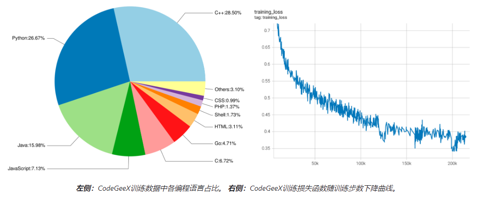
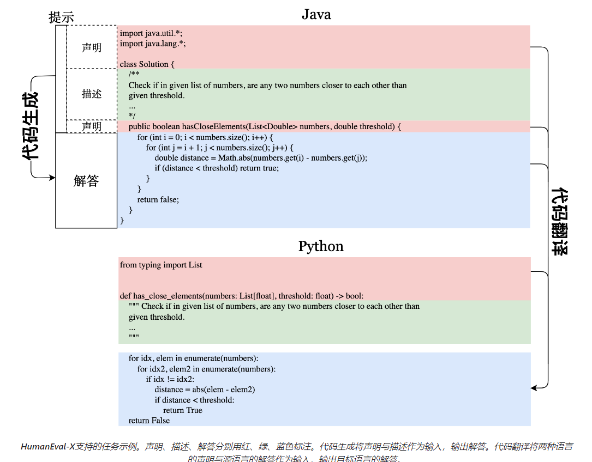
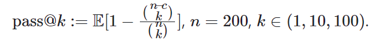

# CodeGeeX [THU] [2022.09] [[Open]](https://github.com/THUDM/CodeGeeX)

Paper:[CodeGeeX: A Pre-Trained Model for Code Generation with Multilingual Evaluations on HumanEval-X](https://arxiv.org/abs/2303.17568)

```yaml
Model Architecture: Decoder Only,GPT Family
Params: 13B
Training Data: The Pile,CodeParrot,Collected[Code: 158B tokens(850B tokens trained)]
Training Time: 1536 Ascend 910 AI processors (32GB) with Mindspore (v1.7.0),two months
Languages: 23 langs
Evaluation: HumanEval-X,HumanEval,MBPP,CodeXGLUE,XLCoST
Supported Tasks: Multilingual Code Generation,Code Translation
```


## CodeGeeX: 多语言代码生成模型

**架构**：CodeGeeX是一个基于transformers的大规模预训练编程语言模型。它是一个从左到右生成的自回归解码器，将代码或自然语言标识符（token）作为输入，预测下一个标识符的概率分布。CodeGeeX含有40个transformer层，每层自注意力块的隐藏层维数为5120，前馈层维数为20480，总参数量为130亿。模型支持的最大序列长度为2048。



**语料**：CodeGeeX的训练语料由两部分组成。第一部分是开源代码数据集，[The Pile](https://pile.eleuther.ai/) 与 [CodeParrot](https://github.com/huggingface/transformers/tree/main/examples/research_projects/codeparrot)。The Pile包含GitHub上拥有超过100颗星的一部分开源仓库，我们从中选取了23种编程语言的代码。第二部分是补充数据，直接从GitHub开源仓库中爬取Python、Java、C++代码；为了获取高质量数据，我们根据以下准则选取代码仓库：1)至少拥有1颗星；2)总大小<10MB；3)不在此前的开源代码数据集中。我们还去掉了符合下列任一条件的文件：1)平均每行长度大于100字符；2)由自动生成得到；3)含有的字母不足字母表内的40%；4)大于100KB或小于1KB。为了让模型区分不同语言，我们在每个样本的开头加上一个前缀，其形式为`[注释符] language: [语言]`，例如：`# language: Python`。我们使用与GPT-2相同的分词器，并将空格处理为特殊标识符，词表大小为50400。整个代码语料含有23种编程语言、总计1587亿个标识符（不含填充符）。


## HumanEval-X: 多语言代码生成基准

为了更好地评测代码生成模型的多语言生成能力，我们构建了一个新基准HumanEval-X。此前，多语言代码生成能力是基于语义相似度（比如[CodeBLEU](https://arxiv.org/abs/2009.10297)）衡量的，具有一定误导性；HumanEval-X则可用于衡量生成代码的功能正确性。HumanEval-X包含820个高质量手写样本，覆盖Python、C++、Java、JavaScript、Go，可用于多种任务。

 

HumanEval-X中每个语言的样本，包含了声明、描述和解答，它们之间的组合可以支持不同的下游任务，包括生成、翻译、概括等。我们目前关注两个任务：**代码生成**与**代码翻译**。对于代码生成任务，模型将函数声明与文档字符串作为输入，输出函数实现；对于代码翻译任务，模型将两种语言的函数声明与源语言的实现作为输入，输出目标语言上的实现。我们在代码翻译任务中不将文档字符串输入模型，以避免模型直接通过描述生成答案。在两种任务下，我们都采用[Codex](https://arxiv.org/abs/2107.03374)所使用的无偏pass@k指标，判断生成代码的功能正确性: 


