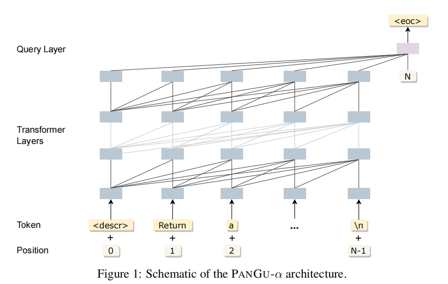

# Pangu-Coder [Huawei Noah’s Ark Lab] [2022.07] [Close]

Paper:[PanGu-Coder: Program Synthesis with Function-Level Language Modeling](https://arxiv.org/abs/2207.11280)

```yaml
Model Architecture: PANGU-α architecture,Decoder Only
Params: 2.6 B
Training Data: Collected(147GB)
Training Time: - 
Languages: python
Evaluation: HumanEval,MBPP
Supported Tasks: Code Generation
```


**1. 训练数据**

PanGu-Coder使用了380GB的原始Python文件，通过MD5校验，限制文件大小、代码长度以及AST解析等方式对原始文件进行了清洗、去重等工作，最终得到了147GB的数据用作模型训练阶段的输入。

为了提升函数级代码生成的效果，每个Python文件中的代码语料均按照函数级的方式进行了重新组织。例如：如果某个函数的定义之后紧接着对于函数的自然语言注释，该注释将被放置到函数定义之前，形成自然语言到代码的配对数据，并用以构建训练数据集。

**2. 训练方法**

PanGu-Coder将训练分为了两个阶段：第一阶段使用了全量的代码数据进行训练；第二阶段选择了更符合目标任务的自然语言和代码对作为训练数据对模型进行调优。



由于PanGu-Alpha所采用的的自回归Transformer架构所具备强大的文本生成能力，在PanGu-Coder的训练中也沿用了此模型架构用于代码生成任务，其架构如图1所示。同时，PanGu-Coder也沿用了PanGu-Alpha的中英文多语词表，从而同时具备支持中英文输入的能力。
