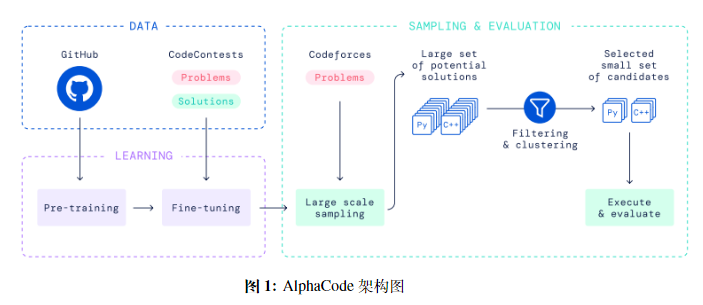

# AlphaCode [DeepMind] [2022.03] [Close]

Paper:[Competition-Level Code Generation with AlphaCode](https://arxiv.org/abs/2203.07814)

```yaml
Model Architecture: Encoder-Decoder
Params: 41B
Training Data: Collected[Code: 715.1GB]
Training Time: -
Languages: 12langs
Evaluation: HumanEval,APPS,CodeContest
Supported Tasks: Competition-Level Code Generation
```


## Contents

[TOC]


## Summary

编程是一个强大而普遍的问题解决工具。开发能够协助程序员甚至自主生成程序的系统可以使编程更具生产力和可访问性，但迄今为止，将人工智能创新融入其中一直是具有挑战性的。最近的大规模语言模型展示了生成代码的惊人能力，现在已经能够完成简单的编程任务。然而，在更为复杂的未知问题的评估中，这些模型的表现仍然很差。例如，需要对算法和复杂自然语言有一定了解的竞赛编程问题仍然极具挑战性。为了填补这一差距，我们引入了AlphaCode，这是一个能够为这些需要更深入推理的问题创造新的解决方案的代码生成系统。在Codeforces平台上的最近编程竞赛的模拟评估中，AlphaCode在超过5000名参与者的比赛中平均排名前54.3％。我们发现，要实现良好而可靠的性能，需要三个关键组成部分：（1）用于训练和评估的广泛而清洁的竞赛编程数据集，（2）大型且高效的基于Transformer的架构，以及（3）大规模的模型抽样来探索搜索空间，然后基于程序行为对提交进行过滤，以获得一小组提交。即海量试错机制, 通过大规模的模型采样来探索搜索空间，然后基于程序行为（比如能否通过单元测试等）进行过滤，最后得到一部分生成样例进行提交。


## Contributions

本模型的两点在生成了大规模的code candidates后，如何进行挑选（sampling）。


## Model



AlphaCode 的架构图，左侧（Data）为模型和数据部分，主要使用 Transformer 进行预训练和微调，右侧（Samping \& Evaluation）是如何生成代码并参与 Codeforces 比赛。

AlphaCode 使用了一个 Transformer 模型，根据编程题目描述，生成百万份代码，这些生成的代码中99%可能根本跑不通。AlphaCode 使用编程题目中的test cases，验证这些生成的代码，这个过程会过滤掉99%的错误代码。经过过滤之后，仍然可能有上千份代码能跑通，而且这些能跑通题目给出的测试样例的代码中很多非常相似。一个编程题目只有10次提交机会，每一次提交的机会都非常珍贵。不可能将上千份代码都提交上去。AlphaCode 这时候做了一个聚类（Clustering）。首先：AlphaCode 使用了第二个 Transformer 模型，根据编程题目中的文字描述，自动生成一些test cases。但是生成的test cases并不保证准确性，它是为了接下来的聚类用的。然后：将生成的test cases喂给那些代码，如果一些代码的生成结果近乎一样，说明这些代码背后的算法或逻辑相似，可被归为一类。文章称，经过聚类之后，从数目较大的类中选出代码去提交，更有胜算。

上述过程大致包括四步：

1. 根据编程题目中的描述等信息，使用第一个 Transformer 模型，生成百万份代码。
2. 使用编程题目中的测试样例 test cases 验证这百万份代码，把不能通过的过滤掉，剩下大约上千份代码。
3. 使用第二个 Transformer 模型，生成一些 test cases。
4. 使用第 3 步生成的 test cases，对第 2 步留下的代码进行验证并聚类，如果两份代码得到的结果相同，则分到同一类。经过聚类后，最终留下 10 类代码。


## Experiments

在HumanEval, APPS, CodeContest（paper 中提出）上进行了测试


## Conclusion

本研究提出了一个名为AlphaCode的系统，用于在竞赛编程中生成解决未知编程问题的新型解决方案。在Codeforces上进行的评估表明，AlphaCode的表现与中等水平竞争者相当。我们发现，大规模扩展采样，然后过滤和聚类样本到一个小集合，以及新的采样高效的transformer架构支持大规模采样是实现良好性能的关键。我们的干净数据集和强大的评估程序也对指导我们的研究进展做出了重要贡献。通过详细分析，我们还表明没有证据表明AlphaCode复制了以前解决方案的重要部分或利用了问题结构的弱点。这表明我们的模型确实能够解决它从未见过的问题，即使这些问题需要进行大量推理。最后，我们展示了各种模型探测的结果，并讨论了这些代码生成模型的广泛影响和风险。
