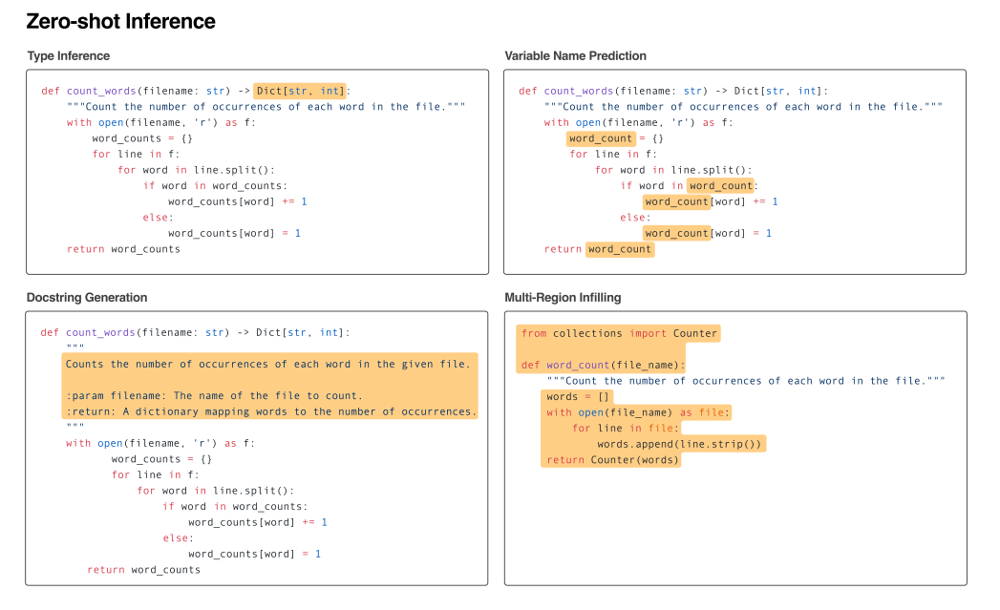
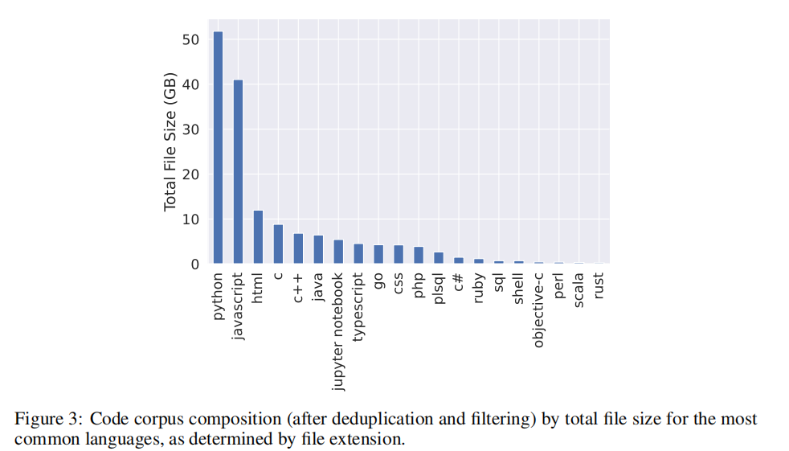

# Incoder [Meta] [2022.04] [[Open]](https://sites.google.com/view/incoder-code-models/)

Paper:[InCoder: A Generative Model for Code Infilling and Synthesis](https://arxiv.org/abs/2204.05999)

```yaml
Model Architecture: Decoder Only
Params: 1.3B,6.7B
Training Data: Collected[Code: 159GB StackOverflow: 57GB(60B tokens trained)]
Training Time: -
Languages: 28 langs
Evaluation: HumanEval,MBPP,CodeXGLUE
Supported Tasks: Infilling Lines Of Code (HumanEval),Docstring Generation (CodeXGLUE), Return Type Prediction,Varible Name Predic
```


[TOC]


## Summary

编写代码不是一个线性过程，而是涉及多轮编辑和完善的过程。为了解决这个问题，研究人员引入了一种名为INCODER的新模型，它是一种生成模型，既可以合成代码（通过从头开始生成），也可以编辑代码（通过屏蔽和填充）。

该模型是在大量许可代码库上训练的，其中代码的某些区域被随机屏蔽并移至每个文件的末尾。这允许模型使用双向上下文填充缺失的代码，这意味着它可以同时考虑屏蔽区域之前和之后的代码。

研究人员指出，他们的模型是第一个能够填充任意代码区域的大型生成代码模型。他们在具有挑战性的任务（例如类型推断、注释生成和变量重命名）上对模型进行评估（Zero-shot），发现基于双向上下文的方式可以显著提高这些任务的性能。

尽管增加了复杂性，但在标准的程序合成benchmark中，该模型的性能仍然与仅从左到右的模型相当。研究人员已经公开了他们的模型和代码，供其他人使用和构建。


## Motivation

在庞大的代码存储库上训练的大型语言模型的局限性：这些模型从左到右生成代码，这使得它们**不太适用于常见的代码编辑任务，例如修复错误、添加注释或重命名变量。**

本文采用了 causal masking objective。将因果语言模型和掩码语言模型的优势结合在一起。允许模型填充以任意左右上下文为条件的代码块，这对于修复错误、添加注释或重命名变量等代码编辑任务很有用。该目标旨在克服标准的从左到右语言模型的局限性，前者无法直接填充文本，而流行的掩码语言模型主要经过训练，可以填充非常短的跨度。


## Model

decoder-only

## Training

### Causal Masking Objective

在训练期间，模型使用Causal Masking Objective从训练文档中随机选择一个或多个代码跨度并将其移至文档末尾。这些跨度的原始位置由special mask sentinel tokens代替。


## Inference

在推理时，可以**通过在所需的位置插入掩码标记**，并允许模型生成可以在该位置插入的代码，从而执行各种代码编辑和填充任务。所显示的所有示例都是INCODER-6.7B模型的真实输出，模型插入的区域用橙色突出显示




## Dataset

我们最终的预训练语料库总共包含159 GB的代码，52 GB的Python代码，以及总共57 GB的来自 StackOverflflow的内容。28种编程语言。




## Evaluation

HUMANEVAL

MBPP

CODEXGLUE


## Conclusion

我们展示了在训练代码生成的生成模型时使用**因果掩码目标**可以在许多具有挑战性和实用的代码填充和编辑任务中实现强大的0-shot表现。该模型的附加填充能力似乎不会损害其进行标准的从左到右生成的能力：消融和比较实验表明，我们的因果掩码模型在标准的从左到右语言到代码综合基准上具有与资源相似的模型相当的性能。展望未来，我们预计随着参数、数据和训练步骤的增加，我们的模型性能将继续提高。此外，微调可以使我们的模型更能够根据自然语言指令和其他人类意图的指示进行调整。最后，我们的模型为未来有监督的填充和编辑工作奠定了基础，可以通过模型微调来执行迭代解码，其中模型可以用于优化自己的输出。