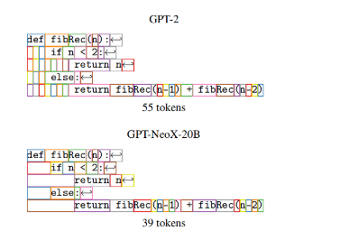

# 代码大模型未来之路

1. 模型容量对多语言能力十分关键。人类程序员在掌握几种编程语言的情况下，能快速迁移到其他语言。与之相反，模型则需要为每种语言分配较大的模型容量来存储相关的知识（一个典型的例子是有着5400亿参数量的PaLMCoder，依靠超大的模型容量取得了惊人的效果），却没有很好抽象出编程语言的高阶知识。如何让模型学习到编程语言的共性，从而快速迁移到其他语言上仍是一个巨大的挑战。

2. CodeGeeX展现了一定的推理能力，但并没有推广到所有语言上。CodeGeeX能使用不同语言解决编程问题，但各种语言擅长解答的问题分布却有较大差异。尽管模型已经能学习到各种语言正确的语法，却无法用不同语言解决同一个问题。我们猜想这可能与不同编程语言的特性有关（比如Python库功能更加完善），或者是因为在训练集中出现了某种语言的类似实现，但缺少了其他语言的。无论是哪种情况，都反映了当前的模型在推理能力上存在局限，让模型获得更加可靠的推理能力还需要长期的研究。

3. CodeGeeX的少样本生成能力亟待进一步探索。对于大规模预训练模型，微调（fine-tuning）的成本是昂贵的，如何使用少量的样本就让模型生成想要的代码，对代码生成模型的实用化具有非常大的意义。近期的一些工作，如思考过程提示方法（chain-of-thought prompting）就展现了惊人的结果，未来可用于代码大模型中。

4. 生成任务中，如果描述过长，大模型的表现会变得更差。如果让代码对变量进行操作，效果会变差。

5. 目前的代码大模型都只是简单的任务描述和简短的解决方案，需要理解算法和复杂的自然语言的竞赛编程问题或者其他复杂的问题仍然极具挑战性。生成复杂的程序通常依赖于理解任务和弄清楚如何完成它，这需要更深层次的算法推理。

6. 多编程语言模型可以跨语言进行泛化，优于单语言模型，并且对低资源编程语言的建模很有用，可能会把其他语言中学到的知识迁移到资源有限的语言上，来提高模型在资源有效的语言上的能力。但这尚未得到经验验证。

7. 研究界很难训练出有能力的LLM。由于计算资源的巨大需求，为了研究各种策略对训练LLM的效果，进行重复、消融研究的成本非常高。实际上，LLM 主要由工业界训练，许多重要的训练细节（如数据收集和清理）并未向公众透露。

8. 预训练数据的质量在实现良好性能方面起着关键作用，目前很多模型的训练数据中都包含了自己收集的数据，在构建预训练语料库时，数据收集和清洗策略非常重要，关于数据的收集，是否含有大量的预训练数据以及数据的质量，是训练代码大模型的一个关键的因素。

9. 训练集中的重复数据删除可以显著提高LLM的性能。语言模型的训练语料库包含许多接近重复的词，当去掉长重复的子字符串时，LLM性能会提高。即使重复一小部分训练数据也会严重损害模型性能，这可能是由于数据记忆消耗了部分容量。

10. 通过对代码的后处理方式提高生成代码的质量。从预训练语言模型里生成的代码质量相对较低，采用后处理的策略进行筛选和过滤，以得到正确的代码。关于后处理的一些方法，可以进一步进行探究。

11. 自然语言和程序设计语言之间的差别较大，自然语言语法复杂不严格，层次结构不清晰，语义不严谨，表达存在多义性。而程序设计语法简单严格、层次结构清晰、语义严格确定、表达不具有二义性。我们或许可以构造一个新型代码大模型架构，使其生成的程序更加符合程序语法和静态语义——这也是未来代码大模型发展的方向之一。

12. 几乎所有的模型训练时候都对tokenizer进行了更改，尤其是空格。GPT-NeoX-20B标记化可以更好地处理空格，这对于源代码等文本特别有用。

    

13. 量化：量化技术被广泛用于在推理阶段减少大语言模型的时间和空间成本。虽然会损失一些模型性能，但量化语言模型具有更小的模型大小和更快的推理速度。

